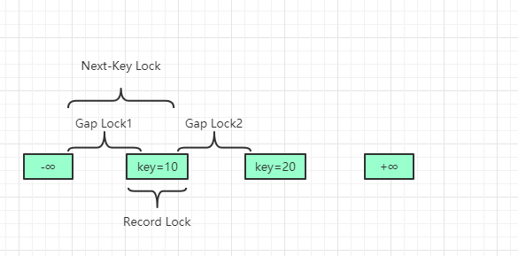

# mysql锁机制

<br>

## 行锁与表锁

<br>

从名字中我们就可以了解：表锁就是对整张表进行加锁，而行锁则是锁定某行、某几行数据或者行之间的间隙。

<br>


|  | 行锁  |	表锁 |  页锁|
|:--------| :---------:|--------:|--------:|
| MyISAM |  |支持 | |
| BDB |  | | 支持|支持|
| innoDB | 支持 | 支持| |

<br>


### 行锁

<br>

行锁是作用在索引上，即使表没有创建索引 ，InnoDB创建一个聚簇索引并将其作为锁作用的索引。
<br>

因为是聚簇索引，所以B+树上的叶子节点都存储了数据行，那么如果现在是二级索引呢？InnoDB中的二级索引的叶节点存储的是主键值（或者说聚簇索引的值），所以通过二级索引查询数据时，还需要将对应的主键去聚簇索引中再次进行查询。

使用主键索引需要加一把锁，使用二级索引需要在二级索引和主键索引上各加一把锁


sql执行场景
``` sql
update user set age = 10 where id > 49;
```


<br>

### 表锁

<br>

表锁使用的是一次性锁技术，也就是说，在会话开始的地方使用 lock 命令将后续需要用到的表都加上锁，在表释放前，只能访问这些加锁的表，不能访问其他表，直到最后通过 unlock tables 释放所有表锁。

除了使用 unlock tables 显示释放锁之外，会话持有其他表锁时执行lock table 语句会释放会话之前持有的锁；会话持有其他表锁时执行 start transaction 或者 begin 开启事务时，也会释放之前持有的锁。


表锁由 MySQL Server 实现，行锁则是存储引擎实现，不同的引擎实现的不同。在 MySQL 的常用引擎中 InnoDB 支持行锁，而 MyISAM 则只能使用 MySQL Server 提供的表锁。


<br>

### 两种锁的比较

<br>

表锁：加锁过程的开销小，加锁的速度快；不会出现死锁的情况；锁定的粒度大，发生锁冲突的几率大，并发度低；

* 一般在执行DDL语句时会对整个表进行加锁，比如说 ALTER TABLE 等操作；

* 如果对InnoDB的表使用行锁，被锁定字段不是主键，也没有针对它建立索引的话，那么将会锁整张表；

* 表级锁更适合于以查询为主，并发用户少，只有少量按索引条件更新数据的应用，如Web 应用。

行锁：加锁过程的开销大，加锁的速度慢；会出现死锁；锁定粒度最小，发生锁冲突的概率最低，并发度也最高；

* 最大程度的支持并发，同时也带来了最大的锁开销。
* 在 InnoDB 中，除单个 SQL 组成的事务外，锁是逐步获得的，这就决定了在 InnoDB 中发生死锁是可能的。
* 行级锁只在存储引擎层实现，而 MySQL 服务器层没有实现。 行级锁更适合于有大量按索引条件并发更新少量不同数据，同时又有并发查询的应用，如一些在线事务处理（OLTP）系统。
* 
<br>

### InnoDB行锁与表锁

<br>

1. InnoDB中的**行锁**


    InnoDB实现了以下两种类型的行锁：

    * 共享锁（S）：加了锁的记录，所有事务都能去读取但不能修改，同时阻止其他事务获得相同数据集的排他锁；
    * 排他锁（X）：允许已经获得排他锁的事务去更新数据，阻止其他事务取得相同数据集的共享读锁和排他写锁；
1. InnoDB**表锁**——意向锁


    由于表锁和行锁虽然锁定范围不同，但是会相互冲突。当你要加表锁时，势必要先遍历该表的所有记录，判断是否有排他锁。这种遍历检查的方式显然是一种低效的方式，MySQL引入了意向锁，来检测表锁和行锁的冲突。

    意向锁也是表级锁，分为读意向锁（IS锁）和写意向锁（IX锁）。当事务要在记录上加上行锁时，要首先在表上加上意向锁。如果另一个任务试图在该表级别上应用共享或排它锁，则受到由第一个任务控制的表级别意向锁的阻塞。第二个任务在锁定该表前不必检查各个页或行锁，而只需检查表上的意向锁。

    意向锁之间是不会产生冲突的，它只会阻塞表级读锁或写锁。意向锁不于行级锁发生冲突。

**注意：这里的排他 / 共享锁指的都是表锁！！！意向锁不会与行级的共享 / 排他锁互斥！！！ **
如果一个事务请求的锁模式与当前的锁兼容，InnoDB就将请求的锁授予该事务；如果两者不兼容，那么该事务就需要等待锁的释放。   

|  | 排他锁  |	意向排他锁 |  共享锁| 意向共享锁
|:-| :--:|---:|----:|---:|
| 排他锁 | 互斥 |互斥 | 互斥|互斥
| 意向排他锁 |互斥| 兼容| 互斥|兼容|
| 共享锁 | 互斥 | 互斥| 兼容|兼容|
| 意向共享锁 | 互斥 | 兼容|兼容 |兼容|

<br>

### InnoDB的加锁方法

<br>

* 意向锁是 InnoDB 自动加的，不需要用户干预；
  
* 对于UPDATE、DELETE和INSERT语句，InnoDB会自动给涉及的数据集加上排他锁；

* 对于普通的SELECT语句，InnoDB不会加任何锁；事务可以通过以下语句显示给记录集添加共享锁或排他锁：

    * 共享锁（S）：select * from table_name where ... lock in share mode。此时其他 session 仍然可以查询记录，并也可以对该记录加 share mode 的共享锁（允许其他事务进行页增加共享锁）。但是如果当前事务需要对该记录进行更新操作，则很有可能造成死锁。
    * 排他锁（X）：select * from table_name where ... for update。其他session可以查询记录，但是不能对该记录加共享锁或排他锁，只能等待锁释放后在加锁。

1. select for update

    在执行这个 select 查询语句的时候，会将对应的索引访问条目加上排他锁（X锁），也就是说这个语句对应的锁就相当于update带来的效果；

    **使用场景：** 为了让确保自己查找到的数据一定是最新数据，并且查找到后的数据值允许自己来修改，此时就需要用到select for update语句；

    **性能分析：** select for update语句相当于一个update语句。在业务繁忙的情况下，如果事务没有及时地commit或者rollback可能会造成事务长时间的等待，从而影响数据库的并发使用效率。
2. select lock in share mode
    in share mode 子句的作用就是将查找的数据加上一个share锁，这个就是表示其他的事务只能对这些数据进行简单的 select 操作，而不能进行 DML 操作。

    **使用场景：** 为了确保自己查询的数据不会被其他事务正在修改，也就是确保自己查询到的数据是最新的数据，并且不允许其他事务来修改数据。与select for update不同的是，本事务在查找完之后不一定能去更新数据，因为有可能其他事务也对同数据集使用了 in share mode 的方式加上了S锁；

    **性能分析：** select lock in share mode 语句是一个给查找的数据上一个共享锁（S 锁）的功能，它允许其他的事务也对该数据上S锁，但是不能够允许对该数据进行修改。如果不及时的commit 或者rollback 也可能会造成大量的事务等待。

<br>


## 行锁的类型

<br>

根据了锁的粒度将锁分为了行锁与表锁，根据使用场景的不同，又可以将行锁进行进一步的划分：
* Next-Key Lock (临键锁)、
* Gap Lock(间隙锁)、
* Record Lock（记录锁）
* 以及插入意向GAP锁。

不同的锁锁定的位置是不同的，比如说记录锁只锁定对应的记录，而间隙锁锁住记录和记录之间的间隙，Next-key Lock则锁住所属记录之间的间隙。不同的锁类型锁定的范围大致如图所示：



<br>

###  记录锁（Record Lock）

<br>

行锁是加在索引上的，如果当你的查询语句不走索引的话，那么它就会升级到表锁，最终造成效率低下

<br>

###  间隙锁（Gap Lock）

<br>

> A gap lock is a lock on a gap between index records, or a lock on the gap before the first or after the last index record。


间隙锁是一种加在两个索引之间的锁，或者加在第一个索引之前，或最后一个索引之后的间隙。这个间隙可以跨一个索引记录，多个索引记录，甚至是空的。使用间隙锁可以防止其他事务在这个范围内插入或修改记录，保证两次读取这个范围内的记录不会变，从而不会出现幻读现象。

> Gap locks in InnoDB are “purely inhibitive”, which means that their only purpose is to prevent other transactions from inserting to the gap. Gap locks can co-exist. A gap lock taken by one transaction does not prevent another transaction from taking a gap lock on the same gap. There is no difference between shared and exclusive gap locks. They do not conflict with each other, and they perform the same function.


值得注意的是，间隙锁和间隙锁之间是互不冲突的，间隙锁唯一的作用就是为了防止其他事务的插入，所以加间隙 S 锁和加间隙 X 锁没有任何区别。

> Gap locking can be disabled explicitly. This occurs if you change the transaction isolation level to READ COMMITTED. Under these circumstances, gap locking is disabled for searches and index scans and is used only for foreign-key constraint checking and duplicate-key checking.

这段话表明，在 RU 和 RC 两种隔离级别下，即使你使用 select in share mode 或 select for update，也无法防止幻读（读后写的场景）。因为这两种隔离级别下只会有行锁，而不会有间隙锁。而如果是 RR 隔离级别的话，就会在间隙上加上间隙锁。
