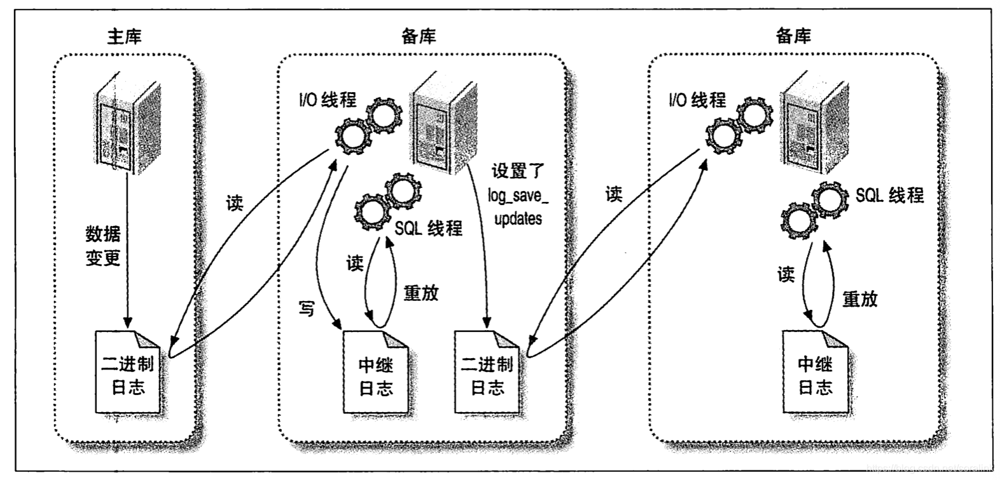

# 复制

Mysql 支持两种复制方式： 基于行的复制和基于语句的复制

## 复制解决的问题

1. 数据分布

    可以在不通的地理位置分布数据备份

2. 负载均衡

    将请求负载到不同的机器上

3. 备份
4. 高可用性和故障切换
5. Mysql升级测试

## 复制是如何工作的

1. 在主库上把数据更改记录到二进制日志中

    在每次准备提交事务完成数据更新前，主库将数据更新的事件记录到二进制日志中。Mysql会按照事务提交的书讯而非每条语句的执行顺序来记录日志，在记录二进制日之后，主库会告诉存储引擎可以提交事务了
2. 备库将主库上的日志复制到自己的中继日志中

    备库将主库的二进制日志复制到其本地的中继日志中。首先，备库会启动一个工作线程，称为I/O线程，I/O线程跟主库建立一个普通的客户端连接，然后在主库上启动一个特殊的二进制转储线程，这个二进制转储线程会读取主库上的二进制日志中的事件，他不会对事件进行轮询。如果该线程追赶上了主库，他将会进入睡眠状态，知道主库发送信号量通知其有新的事件产生时才会被唤醒，备库I/O线程会将收到的事件记录到中继日志中
3. 备库读取中继日志中的事件，将其重放到备库数据之上

    备库的sql线程从中继日志中读取事件并在备库执行，从而实现备库数据的更新

# 基于语句复制的优点

基于语句复制的优点 

* 当主备模式不同的时候，逻辑复制能够在多种情况下工作。例如主备表的定义不同但是数据类型兼容或者列顺序不同。
* 基于语句就是执行SQL，所以在服务器的变更都以一种容易理解的方式运行。出现问题时好定位。

缺点

* 无法正确复制，对于存储过程，触发器以及其他的一些语句复制在5.0和5.1的一些列版本中存在大量的Bug。这些语句的复制方式被更改很多次。如果使用触发器或者存储过程就不要使用基于语句的复制模式，除非能够清楚的确定不会碰到复制问题。
  

基于行复制的优点

* 几乎所有场景都可以用这种方式处理。只是当你试图做一些诸如在备库修改表的schema这样的事情时才可能导致复制失败。
* 这种方式可以减少锁的使用。因为他不要求这种强串行化是可复制的。
* 因为记录的是数据，所以不用才一个语句可能会更改那些数据。另外一些情况基于行的二进制日志还会记录发生改变之前的数据，因此可能有利于数据恢复。
* 由于无需建立执行计划并查询，因此基于行的复制占用更少的CPU。
* 能够快速找到数据不一致的地方
缺点

* 无法知道执行了哪些SQL。
* 无法知道服务器正在做什么，如果出现问题很难找出原因。
* 无法处理在备库修改表schema这样的情况。
* 如果发现不一致可能会停止复制，但是可以通过slave_exec_mode进行配置

# 复制文件

之后看一下复制会用到那些文件。不同版本的MySQL默认情况可能会将这些文件放到不同的目录里面，大多取决具体的配置选项。

1. mysql-bin.index
这个文件是一个和二进制文件同名但是是以index为结尾的文件。这个文件每一行都包含了二进制文件的文件名。MySQL依赖这个文件，如果这个文件没有记录，MySQL识别不了二进制日志文件。

2. mysql-relay-bin-index
这个文件是中继日志的索引文件，和mysql-bin.index的作用类似。

3. master.info
记录备库连接到主库的信息。这个文件以文本的方式记录了复制用户的密码，因此要注意此文件的权限控制。

4. relay-log.info
这个文件包含了当前备库复制的二进制日志和中继日志坐标，如果删除则备库无法得知从哪个位置开始复制。

# 发送复制事件到其他的备库

# 复制拓扑

原则：

* 一个备库只能有一个主库。
* 每个备库必须有一个唯一的服务器ID
* 一个主库可以有多个备库
* 如果打开了log_slave_updates选项，一个备库可以把其主库的数据变化传播到其他备库

## 一主库多备库

用途：

* 为不同的角色使用不同的备库（例如添加不同的索引或者使用不同的存储引擎）
* 把一台备库当作待用的主库，除了复制没有其他数据传输。
* 将一台备库放到远程数据中心用作灾难恢复
* 延迟一个或多个备库，以备灾难恢复
* 使其中一个备库，作为备份，培训，开发或者测试使用服务器

## 主动 - 主动模式下的主 - 主复制(双向复制)
### mysql 不支持多主库复制
    特指一个备库有多个主库
主 - 主复制包含两台服务器，每一个都被配置成对方的主库和备库，也就是一对主库。这种模式应用在一些特殊场景，比如两个不同地理位置的办公室都需要一份可写的数据拷贝。

这种配置最大问题就是解决冲突，比如同时对一行数据进行修改过着用自增键。如果可以仔细配置这种架构例如数据划分可以避免一些问题。但是这种方式的坏处远远大于好处。

## 主动 - 被动模式下的主 - 主复制

**主要区别在于其中的一台服务器是只读的被动服务器。**

在两台服务器上执行如下设置后，会使其拥有对称的设置：

* 确保两台服务器上拥有相同的数据
* 启用二进制日志，选择唯一的服务器ID，并创建复制账号。
* 启用备库更新的日志记录，后面将会看到，这是故障转移和故障恢复的关键。
* 吧被动服务器配置成只读，防止可能与主动服务器上的更新产生的冲突，这一点是可选的。
* 启动每个服务器的MySQL实例。
* 将每个主库设置为对方的备库，使用新创建的二进制日志开始工作。

## 还有很多扩展方式 感觉没什么用？？