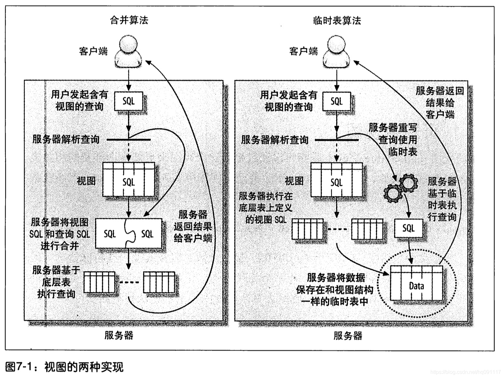

# 视图
视图本身是一个虚拟表，不存放任何数据，在使用sql访问视图时，他返回的数据时Mysql 从其他表中生成的

视图相对于普通的表的优势主要包括以下几项。

* 简单：使用视图的用户完全不需要关心后面对应的表的结构、关联条件和筛选条件，对用户来说已经是过滤好的复合条件的结果集。
- 安全：使用视图的用户只能访问他们被允许查询的结果集，对表的权限管理并不能限制到某个行某个列，但是通过视图就可以简单的实现。
* 数据独立：一旦视图的结构确定了，可以屏蔽表结构变化对用户的影响，源表增加列对视图没有影响；源表修改列名，则可以通过修改视图来解决，不会造成对访问者的影响。

视图可以通过临时表算法或者合并算法生成：
1. 临时表算法更简单，把select结果存放到临时表，访问视图时直接访问临时表。临时表有性能问题，无法创建索引，并且例如select col from view jon tbl where condition，执行该查询时首先建立临时表，建表时不能应用condition过滤条件，数据范围大。
2. 合并算法是推荐算法：除了原表和视图记录无法建立一对一映射的情况（此时采用临时表算法），其他情况下Mysql默认使用合并算法。合并算法会重写含有视图的查询，把视图定义的sql直接合并到查询语句。通过explain可以看到临时表算法实现的视图显示为派生表derived；合并算法可以通过explain extended查看合并后的查询语句。

可以通过更新视图更新原表数据，但需要满足诸多前提条件。

视图的限制很多，如不能创建索引和trigger，不支持物化视图，即将视图结果保存在可查看的表中，并定期从原始表中刷新数据到这个表。总体而言，视图的性能不稳定，尽量避免在查询中使用视图

# 外键

innodb是目前mysql中唯一支持外建的内置存储引擎，所以如果需要外建支持那选择就不多了。
使用外建是有成本的，比如外键通常都要求每次在修改数据时都要在另外一张表中多执行一次查找操作，虽然innodb强制外键使用索引，但还是无法消除这种约束检查的开销。
提升性能场景：如果想确保两个相关表始终有一致的数据，那么使用外键比在程序中检查一致行的性能要高的多，而且外键在相关数据的删除和更新上，也比程序高效。不过外键的操作是逐步进行的，所以会比批量操作慢些。
外键约束使得查询需要额外访问一些别的表，这也意味着需要额外的锁。
有时可以使用触发器来代替外键，对于相关数据的同时更新外键更合适，但是如果外键只是作数值约束，那么触发器或者显式的限制取值会更好些。
总结：通常还是在程序中实现约束会更好，外键的额外消耗会比较大。

# Mysql内部存储代码

mysql允许通过触发器，存储过程，函数的形式，定时任务来存储代码。

优点：
* 他在服务器内部执行，离数据最近，另外在服务器上执行还可以节省带宽和网络延迟。
* 这是一种代码重用，可以方便的统一业务规则，保证某些行为总是一致，也可以提供一定的安全性。
* 他可以简化代码的维护和版本更新。
* 他可以帮助提升安全，比如提供更细的权限控制。
* 服务器可以缓存存储过程的执行计划，这对于需要反复调用的过程，会大大降低消耗。
* 因为是在服务器部署的，所以备份，维护都可以在服务器端完成。
* 他可以在软件开发和数据库开发之间更好的分工。
* 
缺点：
* mysql本身没有提供好用的开发和调试工具。
* 存储过程会给数据库增加额外的压力。
* mysql并没有什么选项可以控制储存程序的资源消耗，所以在储存过程中的一个小错误，可能直接把服务器拖挂。

# 触发器
可配置在写操作执行前或者执行后触发一段代码，通常用于记录数据变更日志。InnoDB把触发器和SQL放在一个事务，如果触发器失败则sql语句也会失败。触发器基于一行数据，如果变更数据量很大则效率地下。

定时任务定时执行sql代码，又称为事件；通常把代码封装为存储过程进行调用。事件线程和连接线程独立，可通过information schema.events查看事件状态。

# 游标cursor
指向临时表中的数据，可以逐行指向查询结果；只读且单向，只能在存储过程或api中使用，

通过declare cursor声明，通过open/close cursor来打开或关闭；declare f cursor for select filmId from tbl; 打开游标时全表扫描tbl数据表，如果只需要扫描某些，推荐使用limit。

# 插件
Mysql提供插件接口，为用户提供可扩展性。常见插件如：information schema插件可以提供一个新的information schema表；审计插件用于记录日志；存储过程插件；认证插件；全文解析插件提供分词功能，增强词语匹配功能；后台插件，实现网络监听，执行自定义定期任务。

# 分布式（XA）事务

分布式事务让存储引擎级别的ACID可以扩展到数据库层面，甚至可以扩展到多个数据库之间---- 这需要通过两阶段提交

xa事务中需要一个事务协调器来保证所有的事务参与者都完成了准备工作（第一阶段），如果协调器收到所有的参与者都准备好的消息，就会告诉所有的事务可以提交了（第二阶段）

内部xa事务：

mysql本身的插件式架构导致在其内部需要使用xa事务，mysql中各个存储引擎是完全独立的，彼此不知道对方的存在，所以需要一个外部协调者，xa事务会带来巨大的性能下降。

外部xa事务：

Mysql能够作为参与者完成一个外部的分布式事务。因为通信延迟和参与者本身可能失败，所以外部事务比内部小号更大。

# 查询缓存
很多数据库产品都能够缓存查询计划，对于相同类型的Sql就可以跳过SQL解析和执行计划生成阶段。
查询缓存系统会跟踪查询中设计的每个表，如果这些表发生变化那么和这个表相关的所有缓存数据都将失效。

